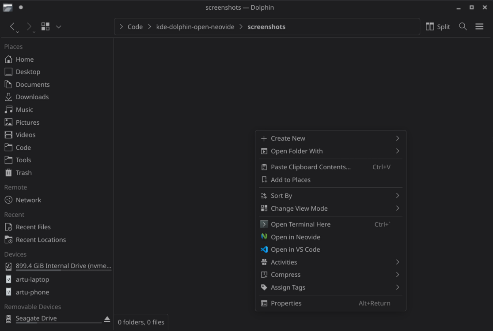

# Dolphin: Open in Neovide

Add context menu to Dolphin to easily open Neovide at location on right click.

Inspired by [Merrit/kde-dolphin-open-vscode](https://github.com/Merrit/kde-dolphin-open-vscode)

## How to install

Execute the following command to install:

```bash
chmod +x ./install.sh
./install.sh
```

## Customization

By default, the extension works only on directories. If you want to enable it on files as well, edit the `openInNeovide.desktop` file and change the `MimeType` line to `all/all` or `inode/directory;{your_type}`.

## Screenshot


